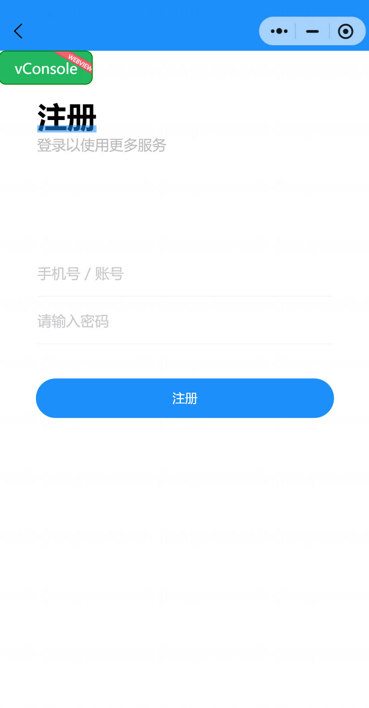

基于Springboot的自习室管理系统（程序+论文）
=

### 完整代码获取地址：从戎源码网 ([https://armycodes.com/](https://armycodes.com/))
### 作者微信：19941326836  QQ：952045282 
### 承接计算机毕业设计、Java毕业设计、Python毕业设计、深度学习、机器学习
### 选题+开题报告+任务书+程序定制+安装调试+论文+答辩ppt 一条龙服务
### 所有选题地址https://github.com/nature924/allProject

一、项目介绍
---

基于 Spring Boot 的自习室管理系统，采用前后端分离＋小程序多端接入，系统角色包含超级管理员、管理员（教室管理员）和学生用户。核心模块与功能如下：

超级管理员
基本操作：登录、修改密码、查看/修改个人信息
用户管理：查看/新增/删除/编辑用户，查看在线状态
权限与角色管理：新增角色、查看/分配角色权限、删除/筛选角色
教室管理：筛选教室、查看教室详情、新增/修改/删除教室、上传教室图片
预约管理：查看所有预约、强制取消、导出/统计预约数据
审批管理：审批预约请求、查看审核记录
公告管理：发布/编辑/删除公告、查看公告列表
系统配置：配置开放时间、最大预约时长等

管理员（教室管理员）
基本操作：登录、修改密码、查看/修改个人信息
教室管理：查看/编辑教室信息、维护教室状态
预约审批：审核或拒绝用户预约、查看审批记录
维修/通知：发布维修记录、发布公告/通知
查看统计：查看部门/楼层的预约与使用统计

学生用户
基本操作：注册/登录、修改个人信息
教室浏览：查看教室列表与详情、查看可用时间
预约操作：发起预约、修改/取消预约、查看个人预约记录
消息/公告：查看系统公告与通知
小程序端：支持在微信小程序端快速预约与查看个人信息

二、项目技术
---
- 编程语言：Java
- 数据库：MySQL
- 项目架构：B/S架构
- 前端技术：JSP
- 后端技术：Spring、SpringMVC、MyBatis

三、运行环境
---
- 操作系统：Windows、macOS都可以
- JDK版本：JDK1.8以上都可以
- 开发工具：IDEA、Ecplise、Myecplise都可以
- 数据库: MySQL5.7以上都可以
- Tomcat：任意版本都可以
- Maven：任意版本都可以

四、运行截图
---
### 论文截图：

### 程序截图：

